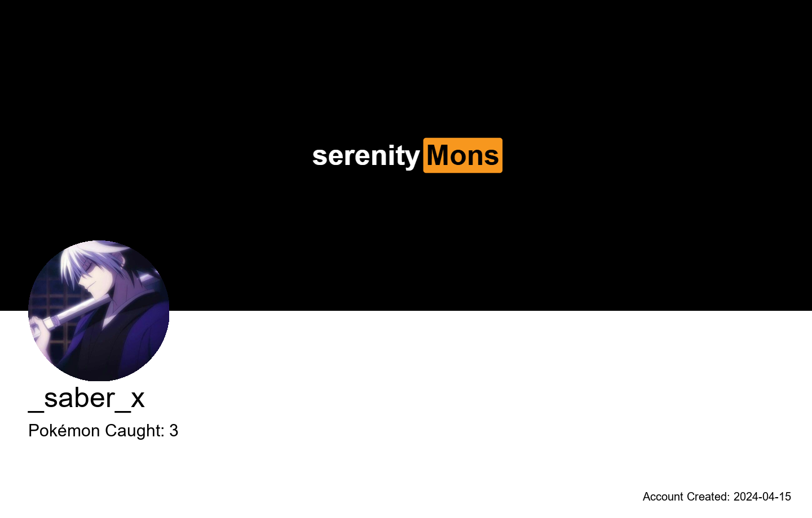

### How Did I Create This Image?

Well, I’m not ashamed to admit it but I've been reusing the same concept everywhere like here: [image porcessor](https://github.com/RyuZinOh/image-processor), [my oldest project](https://github.com/RyuZinOh/Expertise)and yea [mimic projetc for a BCA group](https://github.com/RyuZinOh/BCA-Group) because who needs to create something new when you can just keep recycling the same thing over and over like a sad, creatively bankrupt ghost? Here’s how I did it (if you really want to know, but I’m not sure why you’d care):

1. **Canvas Creation**: First, I made a canvas that’s 1440x920 pixels. Why that size? I have no idea, but it seemed decent enough to make something that *might* look good. I used the `Pillow` module, so yeah, a fancy Python library that I barely understand, but it got the job done. I swear, even my coding has an existential crisis.

2. **Bisector and Sectioning**: I drew a bisector line because apparently dividing things into two sections makes them look… professional? This line splits my canvas into an upper "G section" (I think for 'Good', I really hope that's what it stands for) and a lower "user proportion" (sounds important, right? But honestly, it’s just where I plop the avatar). 

3. **User Avatar Creation**: 
   - The user avatar? Oh, it’s a circle. A *perfect* circle. Because why be creative when you can just lazily put a perfect shape on the screen? The avatar's size matches the bisector's miniaml length and yes for no real reason for that, just seems symmetrical. It's positioned so perfectly that I must've spent all of 3 seconds deciding where to put it.  
   - I made sure its `x` coordinate aligns with the edge of the canvas, because nothing says "look at me" like being forced to the corner. The `y` coordinate? Just above the midpoint, which *might* be artistic or just the easiest spot. Who knows?

4. **User Information Placement**: 
   - Underneath the avatar, I’ve decided to *graciously* provide your username and Pokomon count, but honestly, I just threw those in there because every profile needs some kind of information, right? And I’ve got nothing better to do.
   - I centered the text horizontally, as if that makes it more “aesthetic,” but who are we kidding? The `y` offset is 250 pixels from the avatar, just far enough to give the illusion of careful planning. But in reality, it's just me trying to fill space.

---

### Technical Details (Or "I Tried, but Not Really"):

- **Canvas Size**: 1440x920 pixels, because that’s the standard size for… something? 
- **Bisector**: A line splitting things in half. This may or may not symbolize my inner conflict, but I’ll leave that for the philosophers.
- **Avatar**: A circle. Because life is circular, and so are my ideas.
- **Text**: Username and Pokemon count are thrown in there just to make it look like I’ve got things together, but in reality, I’m just waiting for the inevitable downfall.

---

### Profile Demo:

And here’s the demo, though honestly, I’m not sure why you want to see this:

| Profile Image | Description |
|:-------------:|-------------|
|  | This image shows the “masterpiece” I created. The avatar’s placed by some divine mistake, and the text is there because it has to be. I promise, I’m not overthinking itmuch. |

---

This process *technically* makes sure things are aligned. But in the end, it’s just me trying to keep the illusion alive that I know what I’m doing. Spoiler alert: I don’t.

